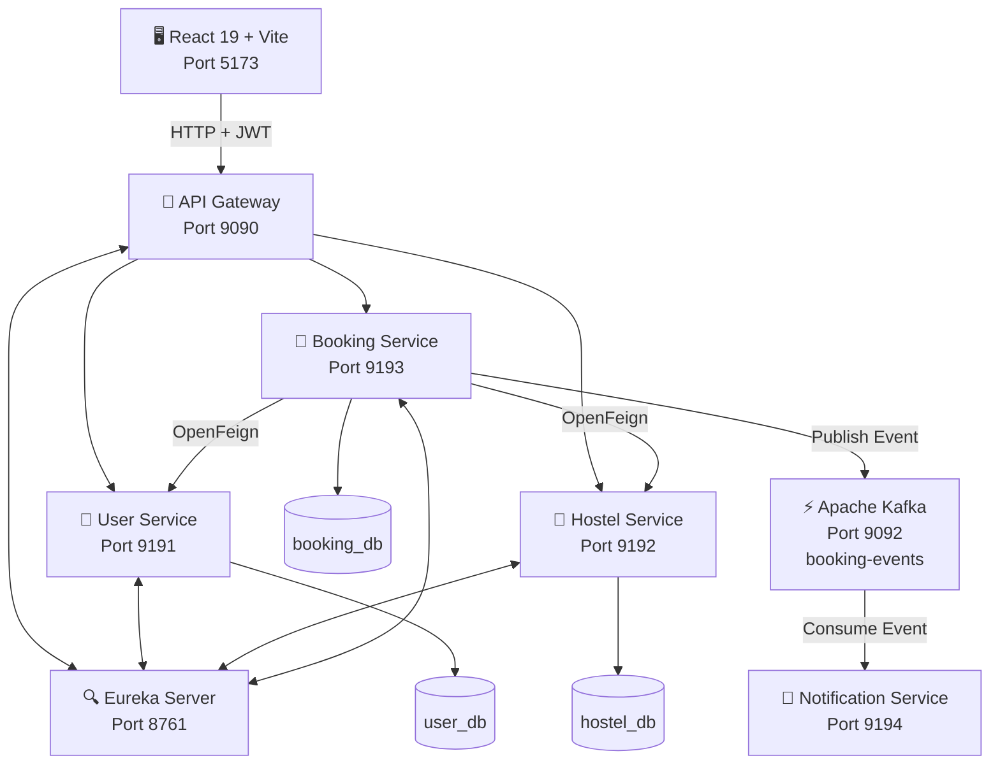

# 🏨 PG Finder — Microservices Accommodation & Reservation Platform

> **An event-driven, full-stack microservices platform for PG/hostel discovery, bed-level inventory management, and reservation workflows.**

PG Finder is a full-stack distributed application designed for managing Paying Guest (PG) and hostel accommodations.

Unlike a traditional hotel booking system that primarily manages rooms, PG Finder manages **individual beds**, room-sharing configurations, gender policies, hostel ownership, availability, and date-based booking conflicts.

The platform is built using **Spring Boot Microservices, Spring Cloud, React, MySQL, OpenFeign, JWT, Eureka, and Apache Kafka**.

---

## 📌 Key Features

### 👤 User & Authentication

* User registration and login
* JWT-based authentication
* BCrypt password hashing
* Role-Based Access Control (RBAC)
* Three user roles:

  * `RESIDENT`
  * `OWNER`
  * `ADMIN`
* User profile management
* Protected API endpoints

### 🏢 Hostel Management

* Create and manage PG/hostel properties
* Manage rooms and beds
* Room-sharing configurations:

  * Single
  * Double
  * Triple
  * Four-plus sharing
* Gender policies:

  * Male
  * Female
  * Co-ed
* Hostel amenities
* Owner-based hostel management
* Cascading Room → Bed lifecycle

### 🛏️ Bed-Level Booking

* Individual bed reservations
* Date-range availability validation
* Booking reference generation
* Booking status lifecycle
* Cancelled bookings excluded from conflict checks
* Owner-controlled booking confirmation
* Stay completion workflow

### 🔔 Event-Driven Notifications

* Apache Kafka integration
* `booking-events` Kafka topic
* Asynchronous notification processing
* Kafka consumer groups
* Booking event publishing and consumption
* Email/SMS notification simulation

### 🔐 Security

* JWT authentication
* HMAC-SHA384 token signing
* BCrypt password hashing
* Gateway-level authentication
* Role-based authorization
* User identity propagation through trusted headers

### 🌐 Frontend

* React 19 + Vite
* React Router
* Axios
* Axios request/response interceptors
* Protected routes
* Role-based UI
* Hostel search and filtering
* Bed selection
* Booking management
* Responsive dark-mode UI

---

# 🏗️ Architecture

PG Finder follows a **microservices architecture** with independent services and a Database-per-Service design.



---

# 🔄 Request Flow

A typical booking request follows this flow:

```text
React Frontend
      │
      │ HTTP + Bearer JWT
      ▼
API Gateway :9090
      │
      │ JWT Validation
      │ X-User-Id
      │ X-User-Role
      ▼
Booking Service :9193
      │
      ├──────────────► User Service :9191
      │                 OpenFeign
      │
      ├──────────────► Hostel Service :9192
      │                 OpenFeign
      │                 Bed Validation
      │
      ▼
Booking Database
      │
      │ Booking Event
      ▼
Apache Kafka
      │
      │ booking-events
      ▼
Notification Service :9194
      │
      ▼
Email / Notification Processing
```

The Gateway validates the JWT and propagates the authenticated user's identity to downstream services using headers such as `X-User-Id` and `X-User-Role`.

---

# 🧩 Microservices

| Service              |   Port | Database     | Responsibility                    |
| -------------------- | -----: | ------------ | --------------------------------- |
| Eureka Server        | `8761` | —            | Service discovery                 |
| API Gateway          | `9090` | —            | Routing, CORS, JWT authentication |
| User Service         | `9191` | `user_db`    | Authentication & users            |
| Hostel Service       | `9192` | `hostel_db`  | Hostels, rooms & beds             |
| Booking Service      | `9193` | `booking_db` | Reservations & conflict detection |
| Notification Service | `9194` | —            | Kafka event consumer              |
| Kafka                | `9092` | —            | Event streaming                   |
| MySQL                | `3306` | Multiple     | Persistent storage                |
| React UI             | `5173` | —            | Frontend application              |

The service and port structure follows the project's documented architecture.

---

# 🔍 Service Responsibilities

## 1. Eureka Server

**Port:** `8761`

Netflix Eureka acts as the service registry.

Microservices register themselves using their application names, allowing other services to discover them dynamically instead of relying on hardcoded hostnames and ports.

```text
USER-SERVICE
HOSTEL-SERVICE
BOOKING-SERVICE
```

---

## 2. API Gateway

**Port:** `9090`

The API Gateway is the single entry point for frontend requests.

Responsibilities:

* Request routing
* JWT validation
* CORS handling
* Authentication filtering
* Identity propagation
* Service discovery integration
* Public endpoint whitelisting

Example routes:

```text
/api/v1/auth/**      → USER-SERVICE
/api/v1/users/**     → USER-SERVICE

/api/v1/hostels/**   → HOSTEL-SERVICE

/api/v1/bookings/**  → BOOKING-SERVICE
```

---

## 3. User Service

**Port:** `9191`

Responsible for:

* Registration
* Login
* User management
* Password hashing
* JWT generation
* Role management

Roles:

```text
RESIDENT
OWNER
ADMIN
```

Passwords are stored using BCrypt, while JWTs are signed using HMAC-SHA384 according to the project's documented implementation.

---

## 4. Hostel Service

**Port:** `9192`

Responsible for hostel inventory.

The domain hierarchy is:

```text
Hostel
   │
   ├── Room
   │      ├── Bed
   │      ├── Bed
   │      └── Bed
   │
   └── Room
          ├── Bed
          └── Bed
```

A hostel contains multiple rooms, and each room contains multiple beds.

The service manages:

* Hostel details
* Address
* Owner
* Gender policy
* Amenities
* Rooms
* Beds
* Room types
* Bed status

The documented JPA relationships use cascading and orphan removal for the Hostel → Room → Bed hierarchy.

---

## 5. Booking Service

**Port:** `9193`

The Booking Service is responsible for reservation orchestration.

Booking states:

```text
PENDING
   │
   ▼
CONFIRMED
   │
   ▼
COMPLETED
```

Cancellation can transition:

```text
PENDING ───────► CANCELLED

CONFIRMED ─────► CANCELLED
```

The service communicates with other services using OpenFeign when it requires information such as bed or user validation.

---

## 6. Notification Service

**Port:** `9194`

The Notification Service is a stateless Kafka consumer.

It listens to:

```text
booking-events
```

using:

```text
notification-group
```

It processes booking events and performs notification processing asynchronously.

---

# 🗄️ Database Architecture

PG Finder follows the **Database-per-Service Pattern**.

```text
                    MySQL
                      │
        ┌─────────────┼─────────────┐
        │             │             │
        ▼             ▼             ▼
    user_db       hostel_db     booking_db
        │             │             │
        ▼             ▼             ▼
   User Service  Hostel Service Booking Service
```

### `user_db`

Contains user-related information.

```text
users
```

### `hostel_db`

Contains:

```text
hostels
rooms
beds
hostel_amenities
```

### `booking_db`

Contains:

```text
bookings
```

Each service owns its database and communicates with other services through APIs or events instead of directly accessing another service's database.

---

# 🔐 Authentication Flow

```text
User
 │
 │ email + password
 ▼
User Service
 │
 │ BCrypt password verification
 ▼
JWT Generation
 │
 ▼
React Frontend
 │
 │ Authorization: Bearer <JWT>
 ▼
API Gateway
 │
 │ Validate signature + expiration
 │
 │ Extract:
 │   userId
 │   role
 │   email
 ▼
Downstream Service
```

The Gateway propagates the authenticated identity using headers:

```text
X-User-Id
X-User-Role
X-User-Email
```

This allows downstream services to use the already validated identity information without repeatedly parsing the JWT.

---

# 📅 Booking Conflict Detection

A major business rule in PG Finder is preventing two active reservations from overlapping for the same bed.

Two booking intervals overlap when:

```text
existing.checkIn < new.checkOut
AND
existing.checkOut > new.checkIn
```

The application also excludes cancelled bookings:

```text
status != CANCELLED
```

Conceptually:

```text
Existing Booking
|----------------------|

          New Booking
       |------------------|

              ❌ Conflict
```

If an active overlapping booking exists, the reservation request is rejected with:

```text
HTTP 409 Conflict
```

The project specifically fixed a "ghost booking" issue where cancelled bookings were incorrectly blocking subsequent reservations.

---

# ⚡ Apache Kafka

Kafka is used for asynchronous booking events.

### Topic

```text
booking-events
```

### Producer

```text
Booking Service
```

### Consumer

```text
Notification Service
```

### Event Flow

```text
Booking Service
      │
      │ BookingEventDto
      ▼
booking-events
      │
      ▼
Notification Service
      │
      ├── Email
      └── SMS / Notification
```

The booking reference can be used as the Kafka message key so that events belonging to the same booking are routed to the same partition, preserving ordering within that partition.

---

# 🔗 OpenFeign Communication

Booking Service uses OpenFeign for synchronous communication.

Example:

```java
@FeignClient(name = "HOSTEL-SERVICE")
public interface HostelServiceClient {

    @GetMapping("/api/v1/hostels/beds/{bedId}")
    BedResponseDto getBedDetails(
        @PathVariable("bedId") Long bedId
    );

    @GetMapping("/api/v1/hostels/{id}")
    HostelResponseDto getHostelById(
        @PathVariable("id") Long id
    );
}
```

Instead of hardcoding:

```text
http://localhost:9192
```

the service uses:

```text
HOSTEL-SERVICE
```

and Eureka/LoadBalancer handles service discovery and instance selection.

---

# 👥 Role-Based Access Control

| Feature            | Resident | Owner | Admin |
| ------------------ | :------: | :---: | :---: |
| Browse Hostels     |     ✅    |   ✅   |   ✅   |
| View Rooms/Beds    |     ✅    |   ✅   |   ✅   |
| Book Bed           |     ✅    |   ❌   |   ❌   |
| Cancel Own Booking |     ✅    |   ❌   |   ❌   |
| Create Hostel      |     ❌    |   ✅   |   ❌   |
| Manage Own Hostel  |     ❌    |   ✅   |   ❌   |
| Confirm Booking    |     ❌    |   ✅   |   ❌   |
| Complete Booking   |     ❌    |   ✅   |   ❌   |
| Delete Hostel      |     ❌    |  Own  |  Any  |
| Manage Users       |     ❌    |   ❌   |   ✅   |

The project's access model separates resident booking responsibilities, owner property operations, and administrative platform management.

---

# 🎨 Frontend Architecture

The frontend is built with:

* React 19
* Vite
* React Router
* Axios
* Context API
* JavaScript
* CSS

Project structure:

```text
pg-finder-ui/
│
├── src/
│   ├── api/
│   │   └── AxiosClient.jsx
│   │
│   ├── components/
│   │   └── Navbar.jsx
│   │
│   ├── context/
│   │   └── AuthContext.jsx
│   │
│   ├── pages/
│   │   ├── LoginPage.jsx
│   │   ├── RegisterPage.jsx
│   │   ├── HostelListPage.jsx
│   │   ├── HostelDetailsPage.jsx
│   │   ├── MyBookingsPage.jsx
│   │   └── UsersPage.jsx
│   │
│   ├── App.jsx
│   ├── App.css
│   └── main.jsx
```

Axios interceptors automatically attach the JWT to outgoing requests and handle `401 Unauthorized` responses by clearing the session and redirecting the user to the login page.

---

# 🐛 Important Problems Solved

## 1. Ghost Booking Conflict

### Problem

A cancelled booking continued to block the same bed.

### Cause

The overlap query did not exclude cancelled bookings.

### Solution

Added:

```text
status != CANCELLED
```

to the conflict query.

---

## 2. Gateway CORS 401

### Problem

Browser requests failed with a CORS error.

### Root Cause

The Gateway authentication filter attempted to authenticate browser `OPTIONS` preflight requests.

### Solution

Allow `OPTIONS` requests to pass through before JWT authentication.

```java
if (exchange.getRequest().getMethod() == HttpMethod.OPTIONS) {
    return chain.filter(exchange);
}
```

This issue and its resolution are documented in the project's RCA section.

---

## 3. DTO Identity Mismatch

### Problem

The frontend expected:

```json
{
  "userId": 3
}
```

while the backend returned:

```json
{
  "id": 3
}
```

### Solution

The frontend resolves the identifier using:

```javascript
const resolvedId =
    data.id ||
    data.userId ||
    parsedJwt?.userId;
```

This prevented user booking retrieval from failing because of the DTO naming mismatch.

---

# 🛠️ Technology Stack

### Backend

```text
Java
Spring Boot
Spring MVC
Spring Data JPA
Spring Security
Spring Cloud Gateway
Spring Cloud Netflix Eureka
OpenFeign
Spring Kafka
JJWT
Lombok
Maven
```

### Frontend

```text
React 19
Vite
JavaScript
Axios
React Router
CSS
```

### Database

```text
MySQL 8
Hibernate / JPA
```

### Messaging

```text
Apache Kafka
```

### Architecture Patterns

```text
Microservices Architecture
Database-per-Service
API Gateway
Service Discovery
Event-Driven Architecture
RBAC
Synchronous REST Communication
Asynchronous Messaging
```

---

# 📡 Important API Endpoints

## Authentication

```http
POST /api/v1/auth/register
POST /api/v1/auth/login
```

## Users

```http
GET    /api/v1/users
GET    /api/v1/users/{id}
DELETE /api/v1/users/{id}
```

## Hostels

```http
GET    /api/v1/hostels
GET    /api/v1/hostels/{id}
GET    /api/v1/hostels/owner/{ownerId}
POST   /api/v1/hostels
DELETE /api/v1/hostels/{id}
GET    /api/v1/hostels/beds/{id}
```

## Bookings

```http
POST  /api/v1/bookings
GET   /api/v1/bookings/my
GET   /api/v1/bookings
GET   /api/v1/bookings/hostel/{hostelId}

PATCH /api/v1/bookings/{id}/confirm
PATCH /api/v1/bookings/{id}/complete
PATCH /api/v1/bookings/{id}/cancel
```

## The documented endpoint structure is organized around authentication, hostel inventory, and reservation workflows.

# 🚀 Getting Started

## Prerequisites

Install:

```text
Java 17+
Maven
MySQL 8+
Node.js
npm
Apache Kafka
```

---

## 1. Clone the Repository

```bash
git clone https://github.com/venky4378/PG-Finder.git
cd PG-Finder
```

> Replace the repository URL above if your actual PG Finder repository uses a different name or URL.

---

## 2. Configure MySQL

Create the required databases:

```sql
CREATE DATABASE user_db;
CREATE DATABASE hostel_db;
CREATE DATABASE booking_db;
```

Configure the database credentials in each microservice's:

```text
application.properties
```

or

```text
application.yml
```

---

## 3. Start Kafka

Start your Kafka broker and make sure it is available on:

```text
localhost:9092
```

The application uses:

```text
booking-events
```

for booking event communication.

---

## 4. Start Services

Recommended startup order:

```text
1. Eureka Server
2. User Service
3. Hostel Service
4. Booking Service
5. Notification Service
6. API Gateway
7. React Frontend
```

---

## 5. Start the React Application

```bash
cd pg-finder-ui
npm install
npm run dev
```

Frontend:

```text
http://localhost:5173
```

API Gateway:

```text
http://localhost:9090
```

Eureka:

```text
http://localhost:8761
```

---

# 📊 Service Communication Summary

| From    | To              | Communication | Purpose                  |
| ------- | --------------- | ------------- | ------------------------ |
| React   | Gateway         | REST/HTTP     | Client requests          |
| Gateway | User Service    | HTTP          | Authentication/user APIs |
| Gateway | Hostel Service  | HTTP          | Hostel APIs              |
| Gateway | Booking Service | HTTP          | Booking APIs             |
| Booking | Hostel Service  | OpenFeign     | Bed/hostel validation    |
| Booking | User Service    | OpenFeign     | User validation          |
| Booking | Kafka           | Async         | Publish booking events   |
| Kafka   | Notification    | Async         | Notification processing  |

---

# 🔮 Future Improvements

Potential production enhancements include:

* Redis caching
* Redis distributed locking
* Resilience4j Circuit Breaker
* Transactional Outbox Pattern
* Debezium CDC
* Flyway/Liquibase database migrations
* Elasticsearch-based hostel search
* Docker containerization
* Kubernetes deployment
* CI/CD pipeline
* AWS deployment
* API rate limiting
* Distributed tracing
* Centralized logging
* Prometheus/Grafana monitoring
* mTLS for internal service communication

For high-concurrency booking scenarios, the project documentation identifies database locking or distributed locking as areas that can strengthen protection against race conditions.

---

# 🧠 Architecture Highlights

This project demonstrates practical implementation of:

* Microservices architecture
* Domain separation
* Database-per-Service
* Service discovery
* API Gateway
* JWT authentication
* RBAC
* OpenFeign
* Synchronous inter-service communication
* Apache Kafka
* Event-driven architecture
* Booking conflict detection
* React SPA architecture
* Axios interceptors
* Distributed-system failure handling
* Production debugging and RCA

---

# 📸 Screenshots

Add screenshots of the following to make the repository more convincing:

```text
1. Login Page
2. Registration Page
3. Hostel Listing
4. Hostel Details
5. Bed Selection
6. Booking Page
7. My Bookings
8. Owner Dashboard
9. Admin Dashboard
10. Eureka Dashboard
11. Kafka Event Logs
12. Swagger/API Documentation
```

Example:

```markdown
## 📸 Screenshots

### Login


### Hostel Listing


### Hostel Details


### Booking

```

---

# 👨‍💻 Author

**Swamy Ch**

Java Full Stack Developer | Spring Boot | Microservices | React | SQL

GitHub:
https://github.com/venky4378

---

# 📄 License

This project is intended for educational, portfolio, and demonstration purposes.
